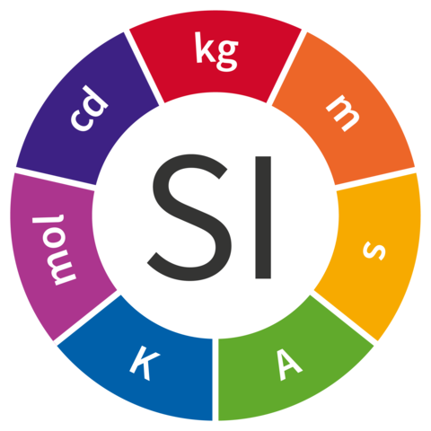

# 数学

## 概念

[数学](https://zh.wikipedia.org/zh-hans/数学)是研究[数量](https://zh.wikipedia.org/zh-hans/量_(数学))、[结构](https://zh.wikipedia.org/zh-hans/数学结构)以及[空间](https://zh.wikipedia.org/zh-hans/空间_(数学))等概念及其变化的一门学科，属于[形式科学](https://zh.wikipedia.org/zh-hans/形式科学)的一种。数学利用[抽象化](https://zh.wikipedia.org/zh-hans/抽象化)和[逻辑](https://zh.wikipedia.org/zh-hans/形式科学)，从[计数](https://zh.wikipedia.org/zh-hans/计数)、[计算](https://zh.wikipedia.org/zh-hans/计算)、[量度](https://zh.wikipedia.org/zh-hans/量度)、对物体[形状](https://zh.wikipedia.org/zh-hans/形状)及[运动](https://zh.wikipedia.org/zh-hans/运动_(物理学))的观察发展而成。[数学家](https://zh.wikipedia.org/zh-hans/数学家)们拓展这些概念，以[公式](https://zh.wikipedia.org/wiki/公式)化新的[猜想](https://zh.wikipedia.org/zh-hans/猜想)，以及从选定的[公理](https://zh.wikipedia.org/zh-hans/公理)及[定义](https://zh.wikipedia.org/zh-hans/定义)出发，[严谨](https://zh.wikipedia.org/zh-hans/严谨)地推导出一些[定理](https://zh.wikipedia.org/zh-hans/定理)。

---

### 数 🔢

“[数](https://zh.wikipedia.org/zh-hans/数)”是“量”的抽象化，有：
[零 $\mathbb {0}$](https://zh.wikipedia.org/zh-hans/0)、
[自然数($\mathbb {N}$)](https://zh.wikipedia.org/zh-hans/自然数)、
[整数 ($\mathbb {Z}$)](https://zh.wikipedia.org/zh-hans/整数)、
[有理数 ($\mathbb {Q}$)](https://zh.wikipedia.org/zh-hans/有理数)、
[无理数](https://zh.wikipedia.org/zh-hans/无理数)、
[实数 ($\mathbb {R}$)](https://zh.wikipedia.org/zh-hans/实数)、
[虚数 ($\mathbb {I}$)](https://zh.wikipedia.org/zh-hans/虚数)、
[复数 ($\mathbb {C}$)](https://zh.wikipedia.org/zh-hans/复数_(数学))。数还有：
[奇数和偶数](https://zh.wikipedia.org/zh-hans/奇偶性_(数学))、
[正数](https://zh.wikipedia.org/zh-hans/正数)和[负数](https://zh.wikipedia.org/zh-hans/负数)、
[分数](https://zh.wikipedia.org/zh-hans/分数)和[小数](https://zh.wikipedia.org/zh-hans/小数)、
[因数](https://zh.wikipedia.org/zh-hans/因数)和[倍数](https://zh.wikipedia.org/zh-hans/倍数)、
[质数](https://zh.wikipedia.org/zh-hans/质数)和[合数](https://zh.wikipedia.org/zh-hans/合数)、
[完全数](https://zh.wikipedia.org/zh-hans/完全数)、
[规矩数](https://zh.wikipedia.org/zh-hans/规矩数)、
[数学常数](https://zh.wikipedia.org/zh-hans/数学常数)、
[代数](https://zh.wikipedia.org/zh-hans/代数)……😵

$$
\mathbb{N} \subseteq \mathbb{Z} \subseteq \mathbb{Q} \subseteq \mathbb{R} \subseteq \mathbb{C}
$$

{.center}

#### 有理数

有理数（英语：rational number）是“可理解”的数，是**可以表示为两个整数之比的数**（其中分母非零），即所有**分数**（含分母为1的分数，即整数），都可以用**有限小数**或**循环小数**表达。

$$
\mathbb{Q} = \left\{ \frac{a}{b} \,\middle|\, a,b\in\mathbb{Z}, b\neq0 \right\}
$$

分数有：

1. **单位分数**：分子为 1 的分数（如 $\frac{1}{3}$​）
2. **真分数**：分子绝对值小于分母绝对值（如 $\frac{2}{3}$​）。
5. **带分数**：由整数部分和真分数部分组成（如 $1\frac{2}{3}$​）。
3. **假分数**：分子绝对值大于或等于分母绝对值（如 $\frac{5}{3}$​）。
4. **最简分数**：分子与分母**互质**，无法进一步约分（如 $\frac{3}{4}$​​）。

#### 无理数

无理数（英语：irrational number）是有理数的反面，既没有指定的字母符号去标识它们，也没有象有理数那样明确的定义，若将其写成小数形式，小数点后有无限多位，并且不会循环，即**无限不循环小数**。无理数的代表有：

- $\sqrt{2} = 1.4142135623730951…$
- $e = 2.71828182845904523536…$
- $\pi = 3.141592653589793238462…$

#### 因数与倍数 {#factor}

[因数](https://zh.wikipedia.org/zh-hans/因数)（英语：factor）也称 约数、因子、除子、除数（divisor），是一个常见的数学名词，用于描述自然数 $a$ 和自然数 $b$ 之间存在的整除关系，即 $b$ 可以被 $a$整除。这里我们称 $b$ 是 $a$ 的[倍数](https://zh.wikipedia.org/zh-hans/倍数)， $a$ 是 $b$ 的因数或因子（[🖥 获取因数的算法实现](http://127.0.0.1:8000/blog/code/#factor)）。

#### 质数与合数 {#prime}

[质数](https://zh.wikipedia.org/wiki/质数)，又称素数，指在大于1的自然数中，除了 1 和该数自身外，无法被其他自然数整除的数（也可定义为只有 1 与该数本身两个正因数的数）。大于 1 的自然数若不是素数，则称之为[合数](https://zh.wikipedia.org/zh-hans/合数)（也称为合成数）（[🖥 质数相关算法实现](http://127.0.0.1:8000/blog/code/#prime)）。

### 量 📏

“[量](https://zh.wikipedia.org/zh-hans/量_(数学))”是任意一种[数学对象](https://zh.wikipedia.org/zh-hans/数学对象)的任意一种属性的“大小”。“数学的量”是非负实数，可更简单地想成是其与同类对象比较时，放在同一测量尺度下的“长度”， 如：线段的长度、三角形的面积、夹角的角度、苹果的质量、时间的长短等。

#### 单位

[单位](https://zh.wikipedia.org/wiki/计量单位)（unit），在物理学及数学上，是由惯例或法律定义和采用的某一“基础物理量”或“基本计数基准”的确切量值或数值，作为公认的测量标准。单位的给定皆属人为，常伴随着某种表示法，例如米、秒、千克等，以方便人们在沟通某一量时有共通的概念。

[国际单位制](https://zh.wikipedia.org/wiki/国际单位制)以七个基本单位为基础，由此建立起一系列相互换算关系明确的“一致单位”。

{.center width=200}

## 概率

概率，旧称几率，又称机率、机会率或或然率，是对随机事件发生之**可能性**的度量，为数学概率论的基本概念。

概率的值是一个在 0 到 1 之间的实数，也常以百分数来表示。完全没有可能时概率为 0，只有一种可能时概率为 1。投 6 面骰子的结果有 6 种可能，其中单数的可能有 3 种，故投出单数的可能性 $p = \dfrac{3}{6} = \dfrac{1}{2}$。

### 排列

[排列数](https://zh.wikipedia.org/zh-hans/排列)（英语：Permutation）是将**相异对象**根据确定的顺序重排的所有不同排法的个数。排列数可写作：

$$
 \begin{align} A_{10}^3 &= \underbrace{10\times9\times8}_{3个} = 720 \newline A_n^n &= \underbrace{n\times(n-1)\times(n-2)\times\cdots\times1}_{n个} = n! （A_n^n叫全排列，n!叫做n的阶乘） \newline  A_{n}^{m} &= \underbrace{n\times(n-1)\times(n-2)\times\cdots\times(n-m+1)}_{m个} \newline &= \dfrac{n\times(n-1)\times(n-2)\times\cdots\times(n-m+1)\times(n-m)\times(n-m-1)\times(n-m-2)\times\cdots\times1}{(n-m)\times(n-m-1)\times(n-m-2)\times\cdots\times1} \newline &= \dfrac{n!}{(n-m)!} \end{align}
$$

例如：10 个人比赛前 3 名的排列数。

解答：从 10 人中选出第 1 名有 10 种可能，从剩下的 9 人中选出第 2 名有 9 种可能，再从剩下的 8 人中选出第 3 名有 8 种可能，分步过程应用**乘法原理**将各步的可能数相乘，即 $10\times9\times8=720$ 种。

公式 1：$A_n^n = n!$

公式 2：$A_n^m = \dfrac{n!}{(n-m)!}$

### 组合

[组合数](https://zh.wikipedia.org/zh-hans/组合)（英语：Combination）是从 n 个不同元素中取出 m 个元素的所有不同组合的个数，记作：

$$
C_n^m = \dfrac{A_n^m}{A_m^m} = \dfrac{n!}{(n-m)!m!}
$$
